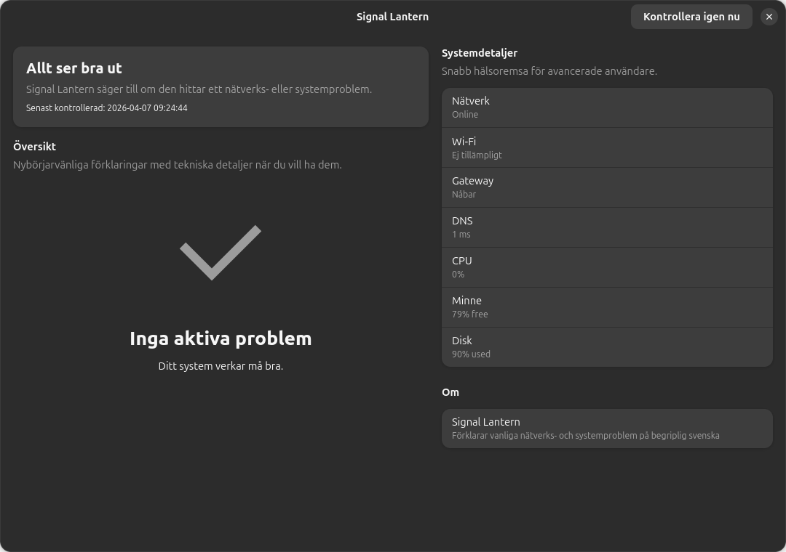

# Signal Lantern



Signal Lantern is a GTK 4 + libadwaita prototype for Linux desktops that watches common network and system problems, explains them in plain English, and still exposes useful technical detail when you want it.

## What the prototype includes

- GTK 4 + libadwaita desktop app shell
- Beginner-first issue cards with expandable technical details
- Periodic background checks for:
  - no network connection
  - captive portal or sign-in required networks
  - Wi-Fi switched off in software
  - Wi-Fi hardware blocked or adapter likely missing
  - weak Wi-Fi signal, when NetworkManager exposes signal data
  - default gateway unreachable
  - slow DNS
  - failing DNS
  - high latency and unstable jitter against public DNS targets
  - restart required after updates or driver changes
  - high CPU load
  - low available memory
  - low disk space
- Desktop notifications on issue appearance or severity change
- English source strings with Swedish localization scaffolding and content
- Localized `.desktop` entry metadata in Swedish
- Unique SVG app icon
- Copy-diagnostics action for advanced troubleshooting
- First-pass accessibility improvements for screen readers and keyboard users
- Simple launch and packaging scripts

## Project layout

- `src/signallantern/app.py` GTK application and UI
- `src/signallantern/checks.py` health engine and Linux probes
- `src/signallantern/models.py` issue/snapshot data model
- `src/signallantern/i18n.py` gettext-based translation loader
- `data/io.github.signallantern.desktop` desktop launcher
- `data/io.github.signallantern.svg` app icon
- `po/sv.po` Swedish gettext catalog
- `scripts/run.sh` local launch helper
- `scripts/package.sh` simple source/appdir packaging helper
- `.github/workflows/transifex-sync.yml` GitHub Actions workflow for source push + translation pull
- `.github/workflows/secret-scan.yml` GitHub Actions workflow for secret scanning
- `scripts/sync-translations.py` completion-gated sync helper for pulled PO files
- `scripts/update-translations.sh` extract source strings and merge updated `.po` files
- `scripts/compile-translations.sh` compile `.po` files into gettext `.mo` catalogs
- `scripts/install-git-hooks.sh` local git hook installer for gitleaks scans

## Runtime dependencies

On Ubuntu or Debian:

```bash
sudo apt install python3 python3-gi python3-gi-cairo gir1.2-gtk-4.0 gir1.2-adw-1 network-manager iproute2 iputils-ping
```

Optional helpers for action buttons:

```bash
sudo apt install gnome-control-center gnome-system-monitor baobab
```

## Run locally from source

```bash
cd /Users/bosse/.openclaw/workspace-main/projects/signal-lantern
chmod +x scripts/run.sh
./scripts/run.sh
```

Or with Python directly:

```bash
PYTHONPATH=src python3 -m signallantern
```

## Test the code without GTK

Syntax/import smoke test:

```bash
cd /Users/bosse/.openclaw/workspace-main/projects/signal-lantern
PYTHONPATH=src python3 -m compileall src
PYTHONPATH=src python3 - <<'PY'
from signallantern.checks import HealthEngine
snapshot = HealthEngine().collect()
print(snapshot.status_line)
print(snapshot.metrics)
print([issue.key for issue in snapshot.issues])
PY
```

## Desktop integration

Install the desktop entry and icon for one user:

```bash
mkdir -p ~/.local/share/applications ~/.local/share/icons/hicolor/scalable/apps
cp data/io.github.signallantern.desktop ~/.local/share/applications/
cp data/io.github.signallantern.svg ~/.local/share/icons/hicolor/scalable/apps/
update-desktop-database ~/.local/share/applications 2>/dev/null || true
gtk-update-icon-cache ~/.local/share/icons/hicolor 2>/dev/null || true
```

If you do not install the console script, adjust `Exec=` in the desktop file to point at `scripts/run.sh`.

## Update and compile translations

```bash
chmod +x scripts/update-translations.sh scripts/compile-translations.sh
./scripts/update-translations.sh
./scripts/compile-translations.sh
```

This refreshes `locale/signal-lantern.pot`, merges `po/*.po`, and writes compiled gettext catalogs under `locale/<lang>/LC_MESSAGES/`.

## Native package builds

Debian/Ubuntu:

```bash
chmod +x scripts/build-deb.sh
./scripts/build-deb.sh
```

Fedora/RHEL-style RPM:

```bash
chmod +x scripts/build-rpm.sh
./scripts/build-rpm.sh
```

## Simple packaging helper

```bash
chmod +x scripts/package.sh
./scripts/package.sh
```

This creates `dist/signal-lantern-appdir.tar.gz`, a lightweight appdir-style bundle containing the launcher, icon, and desktop file.

## Build a .deb (Ubuntu / Debian)

```bash
./scripts/build-deb.sh
```

This installs build dependencies, compiles translations, and runs `dpkg-buildpackage`. The resulting `.deb` lands in the parent directory. Install it with:

```bash
sudo dpkg -i ../signal-lantern_0.1.0-1_all.deb
sudo apt-get install -f   # resolve any missing deps
```

## Build an .rpm (Fedora)

```bash
./scripts/build-rpm.sh
```

This installs build dependencies, creates a source tarball from `git archive`, and runs `rpmbuild`. The resulting `.rpm` lands under `~/rpmbuild/RPMS/noarch/`. Install it with:

```bash
sudo dnf install ~/rpmbuild/RPMS/noarch/signal-lantern-0.1.0-1.*.noarch.rpm
```

## Accessibility

The current UI now includes a first-pass a11y layer:

- accessible labels for the summary, issue list, and system detail rows
- clearer button and expander tooltips for assistive tech
- fewer noisy focus stops, so keyboard users land on controls instead of decorative containers
- keyboard shortcuts for the two global actions:
  - `Ctrl+R` runs health checks again
  - `Ctrl+Shift+C` copies diagnostics
- selectable technical detail rows for copy/paste without turning every detail row into a separate focus stop

This is a pragmatic first pass, not a full accessibility audit.

The UI also now announces material status changes with a lightweight toast instead of forcing noisy focus changes.

For network quality, the app now also keeps a short rolling latency sample against stable public targets such as `1.1.1.1` and `8.8.8.8`, so it can warn about both consistently high latency and unstable jitter.

## Transifex sync CI

The repository includes `.github/workflows/transifex-sync.yml`.

- pushes source updates to Transifex when `locale/signal-lantern.pot` changes on `main`
- pulls translations on a weekly schedule or manual dispatch
- only syncs languages meeting the minimum completion threshold, default `20%`
- opens a pull request instead of merging translation updates automatically

Required GitHub secret:

- `TX_TOKEN`, a Transifex API v3 token with access to the project

## Secret scanning

This repo now has two layers of secret protection:

- local `pre-commit` and `pre-push` hooks via `gitleaks`
- GitHub Actions scanning on pushes, pull requests, and manual runs

To enable the local hooks in this clone:

```bash
cd /Users/bosse/.openclaw/workspace-main/projects/signal-lantern
chmod +x scripts/install-git-hooks.sh
./scripts/install-git-hooks.sh
```

The repo also includes `.gitleaks.toml` for project-local scanning rules.

## Notes and limits

- Wi-Fi quality depends on NetworkManager or `nmcli` exposing signal information.
- DNS timing currently uses a real lookup of `example.com` via the system resolver.
- Gateway reachability uses `ping`, so environments that block ICMP may report false positives.
- The app now loads compiled gettext catalogs when they are available, and falls back to source strings when they are not.
- Tray support is intentionally skipped in this first prototype because modern GTK 4 desktops do not offer a consistent cross-desktop tray API.
